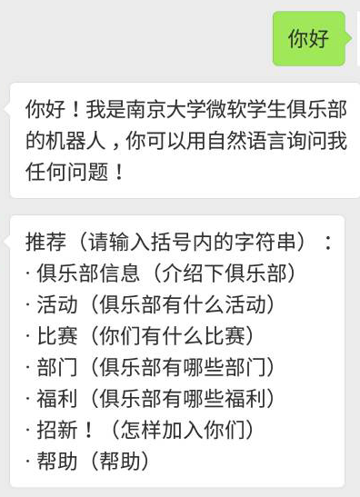
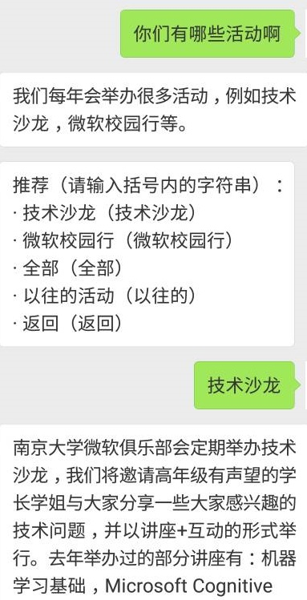
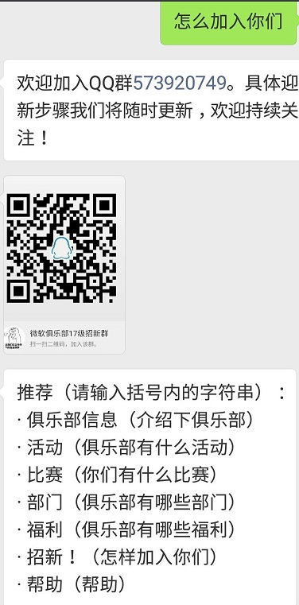

# Bot Framework WeChatter

这是一个基于[itchat](https://github.com/littlecodersh/ItChat)的、转发发到个人号上的信息到[Microsoft Bot Framework](https://dev.botframework.com/)的转发器。

## 特性

- Python 3
- 基于[itchat](https://github.com/littlecodersh/ItChat)和Bot Framework的DirectLine API
- 简单易用
- 少依赖
- 支持同时多用户、多会话（conversation）、多条回复
- 可在无GUI环境运行，使用控制台二维码扫码登录

## 展示

## 开始使用

1. clone本项目
2. `pip install -r requirements.txt`安装依赖
3. 配置`config.py`，修改`bot_secret_key`为bot的DirectLine channel的secret key
4. `python main.py`，扫码登录
5. 一切就绪！

## 微信到Framework支持情况

### 微信到Bot Framework
- [x] 文本
- [x] 图片
- [ ] 语音
- [ ] 视频

### Bot Framework到微信
- [x] 文本
- [x] markdown文本带图片 将会把信息以图片分割成多次信息 
- [x] 图片
- [x] [HeroCard](https://docs.microsoft.com/en-us/bot-framework/rest-api/bot-framework-rest-connector-add-rich-cards)

    因为微信的限制，一个RichCard被分割为多条回复信息。第一条信息包含 `title`和`text`，接下来是图片，**每张图片一条信息**，最后一条信息包含所有`CardAction`，每一个`CardAction`以文本形式占一行。`CardAction`支持情况以及表现形式如下

    | type | 表现形式|
    |----------|-------------|
    | openUrl | `· {title}({url})` |
    | imBack | `· {title}({value})` |
- [x] SuggestedActions 为内容后新的一条信息，表现形式同HeroCard的CardAction部分

### Config.py参数解释

| 参数 | 解释 |
| --- | ---- |
| bot_secret_key | Bot DirectLine的Secret Key |
| poll_interval | 通过HTTP GET获得消息的轮询间隔，以秒为单位 |
| overdue_time | conversation维持时间。超过这个时间没有更新的conversation将会被抛弃。以秒为单位。|